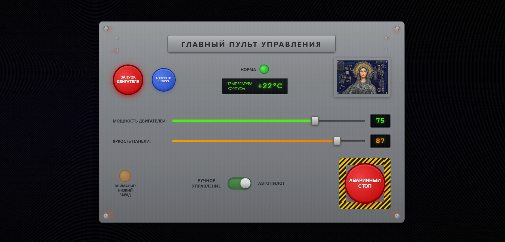
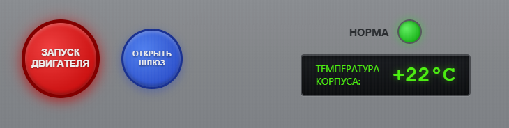
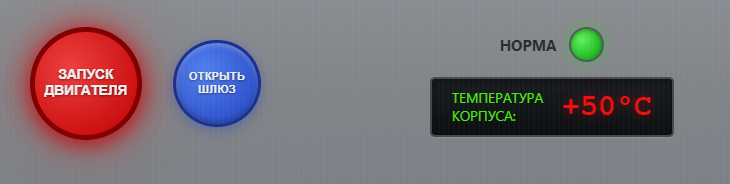
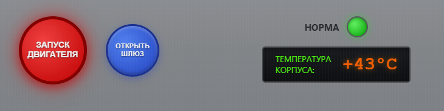
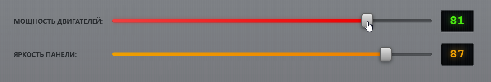
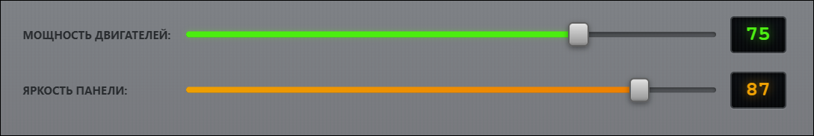
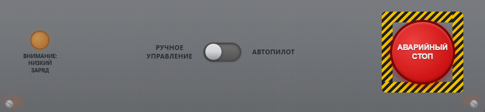
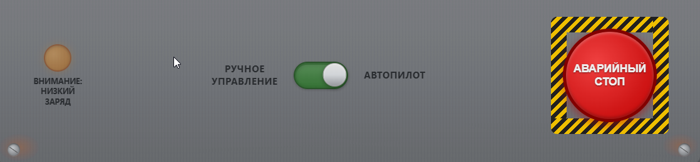
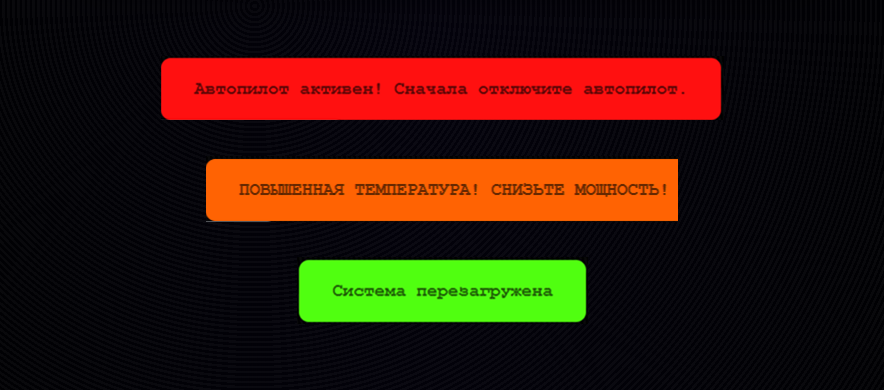

# Главный пульт управления

## Описание

Интерактивная панель управления, симулирующая работу промышленного или космического пульта. Проект демонстрирует сложную логику изменения температуры в зависимости от мощности двигателя, визуальные эффекты, звуковое сопровождение и широкий набор интерфейсных элементов (кнопки, ползунки, тумблеры, индикаторы).

<div style="text-align: center;">
  
</div>

---

## Внешний вид и элементы управления

### Центральная панель

<div style="text-align: center;">
  
</div>

<div style="text-align: center;">
  
</div>

<div style="text-align: center;">
  
</div>


*На центральной панели расположены кнопки запуска двигателя и открытия шлюза, индикатор состояния «Норма» и цифровой дисплей температуры.*

### Ползунки управления

<div style="text-align: center;">
  
</div>

<div style="text-align: center;">
  
</div>


*Верхний ползунок регулирует мощность двигателя (0–100%), нижний – яркость подсветки панели. Цифровые дисплеи показывают текущее значение.*

### Блок автопилота и аварийной остановки

<div style="text-align: center;">
  
</div>

<div style="text-align: center;">
  
</div>


*Тумблер переключения между ручным управлением и автопилотом. Крупная кнопка «Аварийный стоп» – для мгновенной остановки всех систем.*

---

## Основная логика работы пульта

| Компонент / Ситуация                         | Условие / Действие пользователя                                                                      | Логика работы                                                                                                                                                                                                                                                                                 | Отображение / Сообщение                                                                                          |
| -------------------------------------------- | ---------------------------------------------------------------------------------------------------- | --------------------------------------------------------------------------------------------------------------------------------------------------------------------------------------------------------------------------------------------------------------------------------------------- | ---------------------------------------------------------------------------------------------------------------- |
| **Запуск / остановка двигателя**             | Нажатие кнопки «Запуск двигателя» (`engineBtn`)                                                      | Включение: `engineRunning = true`, запуск цикла обновления температуры (интервал `200` или `1000` мс). Выключение: остановка цикла, сброс температуры до `22°C`.                                                                                                                              | Цветовая полоска мощности зелёная (при выкл. двигателе) или зелёная/красная (при вкл. и мощности >80%).          |
| **Управление мощностью**                     | Перемещение ползунка `powerRange`                                                                    | Установка `currentPower`. Если двигатель включён – запускается фаза активного изменения температуры (`heatingPhase = 3`) на 3 тика. Значение синхронизируется с UI (цифровой дисплей, зелёная полоса).                                                                                        | Полоса заполняется на `currentPower`%. При мощности >80% и работающем двигателе полоса становится красной.       |
| **Температура – нагрев (движение вправо)**   | `currentPower > lastPower` (движение вправо) и `engineRunning = true`, фаза `heatingPhase > 0`       | **Скорость нагрева:**<br>• >80% → `+1.5°C` за тик (интервал 200 мс)<br>• ≤80% → `+0.6°C` за тик (интервал 1000 мс)<br>Ограничение: температура не может превышать целевой диапазон (`targetTemp`), который зависит от мощности.                                                               | Температура на дисплее растёт с соответствующей скоростью, цвет текста меняется (зелёный → оранжевый → красный). |
| **Температура – остывание (движение влево)** | `currentPower < lastPower` и `engineRunning = true`, фаза `heatingPhase > 0`                         | **Скорость остывания** (зависит от новой мощности `currentPower`):<br>• >80% → `-1.5°C`/тик<br>• 50–80% → `-0.6°C`/тик<br>• 10–50% → `-1.2°C`/тик<br>• <10% → `-0.6°C`/тик<br>Ограничение: температура не может опускаться ниже минимумов, определённых для диапазона (65, 40, 30, 20, 18°C). | Температура на дисплее падает.                                                                                   |
| **Стабилизация температуры**                 | Ползунок остановлен (`heatingPhase = 0`) и `engineRunning = true`                                    | Температура стремится к целевой (`targetTemp`) со скоростью `0.6°C`/тик (интервал 1000 мс). `targetTemp` зависит от мощности:<br>• ≥80% → 65°C<br>• 76–79% → 40°C<br>• 50–75% → 30°C<br>• 10–49% → 20°C<br>• <10% → 18°C.                                                                     | Температура плавно приближается к цели.                                                                          |
| **Автопилот**                                | Включение тумблера `autoPilotToggle`                                                                 | Устанавливается `autoPilotActive = true`, мощность принудительно ставится 75%. Температура изменяется только в сторону 30°C (шаг `±0.3°C`). Ползунок мощности блокируется.                                                                                                                    | Сообщение «Автопилот активирован»; лампочка низкого заряда тускнеет.                                             |
| **Аварийный стоп**                           | Нажатие кнопки `emergencyBtn`                                                                        | Активация: `emergencyActive = true`, двигатель выключается, все системы сбрасываются, температура = 22°C. Повторное нажатие – сброс аварийного режима.                                                                                                                                        | Кнопка начинает мигать, индикатор статуса красный. Сообщение «АВАРИЙНЫЙ СТОП АКТИВИРОВАН» (error).               |
| **Открытие шлюза**                           | Нажатие `airlockBtn`                                                                                 | Только если двигатель выключен и не активен аварийный стоп. Переключение состояния `airlockOpen`. При открытии кнопка окрашивается в зелёный цвет.                                                                                                                                            | Сообщения: «Шлюз открыт» (success) / «Шлюз закрыт» (warning).                                                    |
| **Сообщения об опасной температуре**         | `currentPower > 80` и:<br>• `temperature > 50`<br>• `temperature == 65`<br>• `39 < temperature ≤ 50` | Первые два – тип `error`, третье – `warning`. Защита от спама (не чаще 1 раза в 4 секунды).                                                                                                                                                                                                   | Всплывающее сообщение с красным/оранжевым фоном, сопровождается звуком `danger.mp3` (для error).                 |
| **Визуализация температуры**                 | В зависимости от текущего значения                                                                   | • >50°C: красный цвет текста + красное свечение.<br>• >39°C: оранжевый цвет текста + оранжевое свечение.<br>• ≤39°C: зелёный цвет текста + зелёное свечение.                                                                                                                                  | Цвет и тень значения температуры.                                                                                |
| **Индикатор низкого заряда**                 | Всегда (имитация)                                                                                    | Лампочка `lowBatteryLight` мигает (оранжевый цвет). При включении автопилота мигание отключается и яркость снижается.                                                                                                                                                                         | Пиктограмма «Внимание: низкий заряд».                                                                            |

---

## Системные сообщения (служебные уведомления)

<div style="text-align: center;">
  
</div>


В интерфейсе выводятся следующие сообщения (через функцию `showMessage`):

| Сообщение                                       | Тип       | Условие / Причина появления                                                |
| ----------------------------------------------- | --------- | -------------------------------------------------------------------------- |
| Двигатель запущен                               | `success` | Нажатие кнопки «Запуск двигателя» при выключенном двигателе                |
| Двигатель остановлен                            | `warning` | Нажатие кнопки «Запуск двигателя» при работающем двигателе                 |
| Шлюз открыт                                     | `success` | Нажатие кнопки «Открыть шлюз» при закрытом шлюзе и отсутствии блокировок   |
| Шлюз закрыт                                     | `warning` | Нажатие кнопки «Открыть шлюз» при открытом шлюзе                           |
| Нельзя открыть шлюз при работающем двигателе!   | `error`   | Попытка открыть шлюз, когда двигатель запущен                              |
| АВАРИЙНЫЙ СТОП АКТИВЕН!                         | `error`   | Нажатие аварийной кнопки (активация)                                       |
| Система перезагружена                           | `success` | Повторное нажатие аварийной кнопки (деактивация)                           |
| Автопилот активирован!                          | `success` | Переключение тумблера автопилота во включённое положение                   |
| Ручное управление!                              | `warning` | Переключение тумблера автопилота в выключенное положение                   |
| Автопилот активен! Сначала отключите автопилот. | `error`   | Попытка изменить мощность через ползунок при активном автопилоте           |
| КРИТИЧЕСКАЯ ТЕМПЕРАТУРА! СНИЗЬТЕ МОЩНОСТЬ!      | `error`   | Мощность >80% **и** температура >50°C (не чаще 1 раза в 4 секунды)         |
| ПЕРЕГРЕВ! ОПАСНОСТЬ ПОВРЕЖДЕНИЯ ДВИГАТЕЛЯ!      | `error`   | Мощность >80% **и** температура достигла 65°C (не чаще 1 раза в 4 секунды) |
| ПОВЫШЕННАЯ ТЕМПЕРАТУРА! СНИЗЬТЕ МОЩНОСТЬ!       | `warning` | Температура >39°C **и** ≤50°C (не чаще 1 раза в 4 секунды)                 |

> **Примечание:** Все сообщения автоматически скрываются через 3 секунды. Сообщения типа `error` сопровождаются звуковым сигналом (`danger.mp3`), который останавливается вместе с исчезновением сообщения.

---

## Звуковое сопровождение

В проекте используются следующие звуковые эффекты. Все аудиофайлы должны находиться в папке `sound/` в корне проекта.

| Событие                                 | Файл                      | Громкость (volume) | Примечание                                                                                       |
| --------------------------------------- | ------------------------- | ------------------ | ------------------------------------------------------------------------------------------------ |
| Наведение на фото («Молитва»)           | `prayer_jp.mp3`           | 1.0                | При повторном наведении звук останавливается                                                     |
| Нажатие «Запуск двигателя»              | `engine.wav`              | 1.0                | Проигрывается при включении                                                                      |
| Нажатие «Аварийный стоп»                | `stop.mp3`                | 1.0                | При активации аварийного режима                                                                  |
| Снятие аварийного стопа (перезагрузка)  | `stop.mp3`                | 1.0                | При возврате в нормальный режим                                                                  |
| Переключение автопилота (вкл/выкл)      | `autoPilot.mp3`           | 0.05               | Звук при любом изменении состояния                                                               |
| Любое сообщение с типом `error`         | `danger.mp3`              | 1.0                | Останавливается при скрытии сообщения                                                            |
| Нажатие кнопки «Открыть шлюз»           | `get2.mp3`                | 1.0                | Проигрывается при клике                                                                          |
| Наведение на заголовок (SOS)            | `SOS.mp3`                 | 1.0                | При повторном наведении звук останавливается                                                     |
| Движение ползунков (мощность / яркость) | `1.mp3`, `2.mp3`, `3.mp3` | 0.1                | Выбирается случайный файл; предыдущий звук прерывается; при отпускании мыши звук останавливается |

> **Примечания:**  
> - Для ползунков используется функция `createAudioWithVolume(src, 0.1)`, поэтому громкость составляет 10% от максимальной.  
> - Остальные звуки воспроизводятся с громкостью `1.0` (100%), если не указано иное.  
> - Все файлы должны лежать в папке `sound/`.  
> - При возникновении ошибок воспроизведения (например, из‑за политики автозапуска браузера) сообщения выводятся в консоль, но не блокируют работу интерфейса.

---

## Структура проекта (основные файлы)
```
control-panel/
├── index.html # Основная страница
├── 1.js # Главная логика пульта (температура, события)
├── sound.js # Звуковое сопровождение
├── style.css # Визуальное оформление
├── sound/ # Папка с аудиофайлами
│ ├── prayer_jp.mp3
│ ├── engine.wav
│ ├── stop.mp3
│ ├── autoPilot.mp3
│ ├── danger.mp3
│ ├── get2.mp3
│ ├── SOS.mp3
│ ├── 1.mp3
│ ├── 2.mp3
│ └── 3.mp3
└── image/ # Изображения (фото, иконки)
  |── 2.png
```


---

## Запуск проекта

1. Сохраните все файлы (`index.html`, `1.js`, `sound.js`, `style.css`) в одной папке.
2. Создайте подпапки `sound` и `image` и поместите в них соответствующие файлы.
3. Откройте `index.html` в любом современном веб-браузере.
4. Наслаждайтесь управлением пультом.

> **Примечание:** Для корректной работы звуков может потребоваться взаимодействие пользователя с интерфейсом (например, первый клик по кнопке) – это ограничение политики браузера.

---
<div style="text-align: center;">
  
</div>


*Проект выполнен в рамках самообучения и не предназначен для реального управления оборудованием.*
