# Крестики-нолики (Tic-Tac-Toe)

## Описание

Веб-приложение классической игры «Крестики-нолики» с многопользовательским режимом, игрой против компьютера, системой авторизации пользователей и уникальным визуальным оформлением. Проект демонстрирует применение многослойной архитектуры Spring Boot, работу с базой данных PostgreSQL и реализацию REST API.

<div style="text-align: center;">
  
</div>

## Особенности

###  Функциональность
-  **Система авторизации** — регистрация и вход с использованием Basic Auth
-  **UUID пользователей** — уникальная идентификация каждого игрока
-  **Режим PvP** — игра между двумя реальными игроками
-  **Режим PvE** — игра против компьютера (AI с алгоритмом Minimax)
-  **История игр** — сохранение всех партий в базе данных
-  **Состояния игры** — ожидание, процесс, победа X/O, ничья
-  **Присоединение к игре** — возможность подключиться к существующей партии по ID
-  **Polling** — автоматическое обновление состояния игры в реальном времени

###  Визуальное оформление
-  **Уникальные иконки** — кастомные графические элементы для X и O
-  **Анимированный курсор** — специальный дизайн курсора мыши
-  **Тёмная тема** — стилизованный интерфейс в древнерусском стиле


###  Архитектура
-  **Многослойная архитектура** — разделение на Web, Domain и Datasource слои
-  **Dependency Injection** — управление зависимостями через Spring DI
-  **JPA/Hibernate** — работа с базой данных через ORM
-  **REST API** — полноценный backend с документированными endpoint'ами
-  **Обработка ошибок** — централизованная обработка исключений
-  **Валидация данных** — проверка входных данных на всех уровнях

## Скриншоты

### Форма входа

<div style="text-align: center;">
  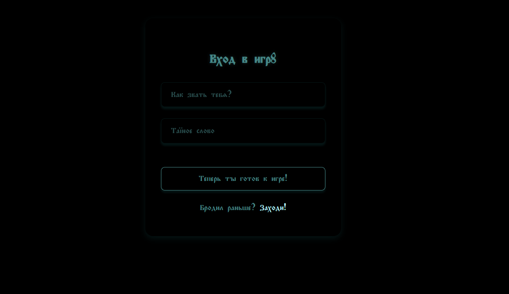
</div>

### Форма регистрации

<div style="text-align: center;">
  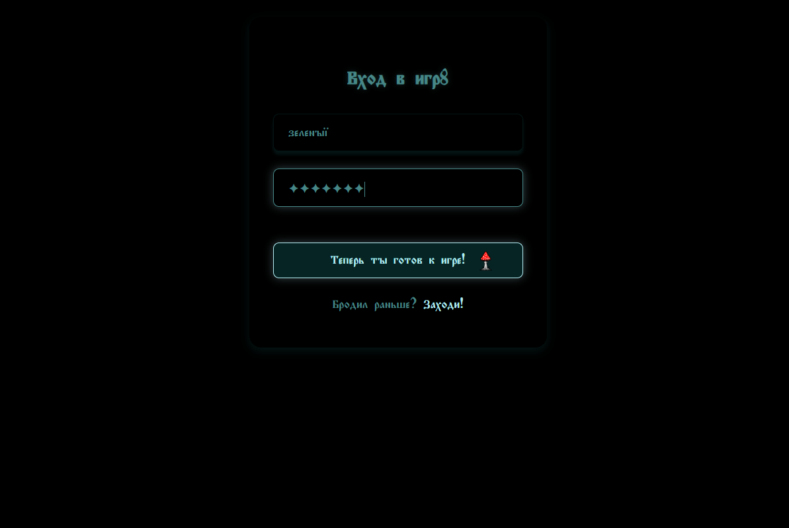
</div>

### Главное меню выбора режима игры

<div style="text-align: center;">
  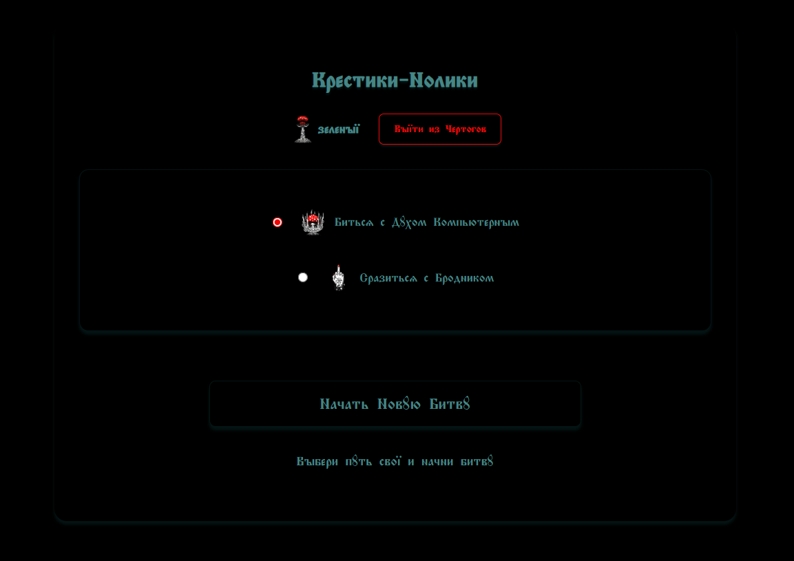
</div>

### Игровое поле (PvP)

<div style="text-align: center;">
  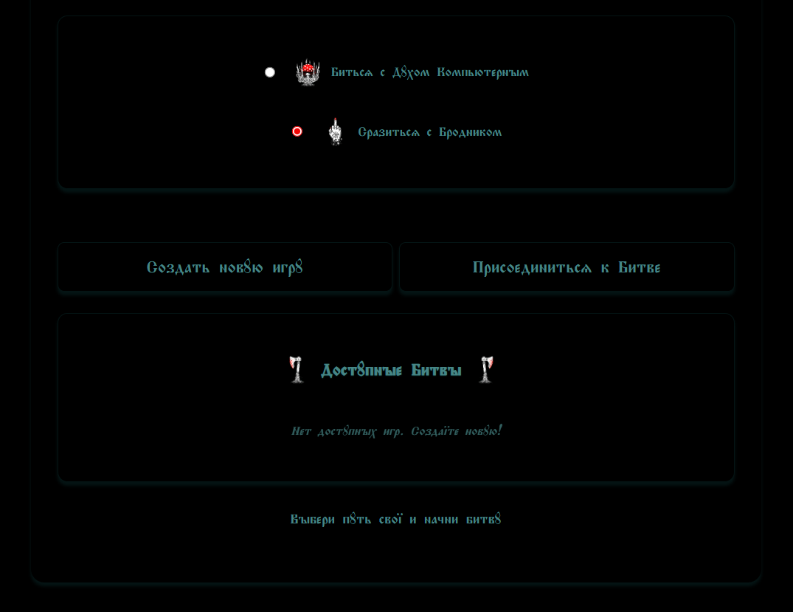
</div>
<div style="text-align: center;">
  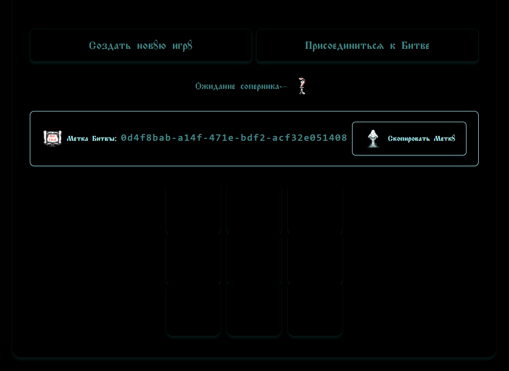
</div>

### Игровое поле (PvE)

<div style="text-align: center;">
  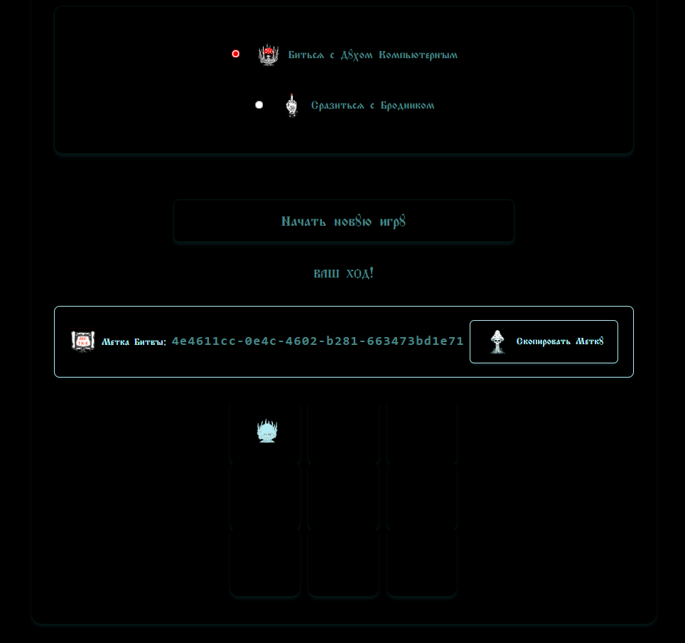
</div>

### Завершённая игра

<div style="text-align: center;">
  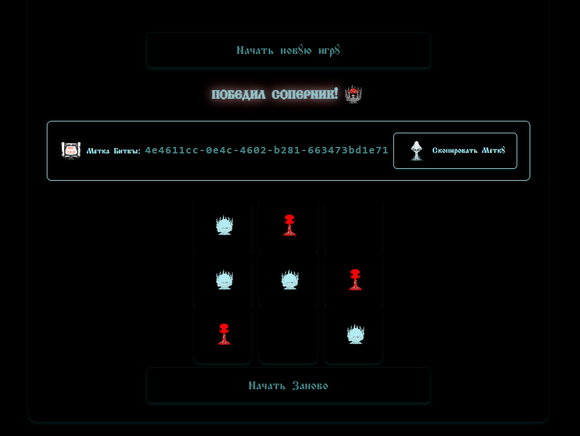
</div>

##  Демонстрация иконок и курсора

В проекте использованы уникальные графические элементы, разработанные специально для этой игры:

### Иконки игроков
- **Крестики (X)**  цветок чертополоха 
<div style="text-align: center;">
  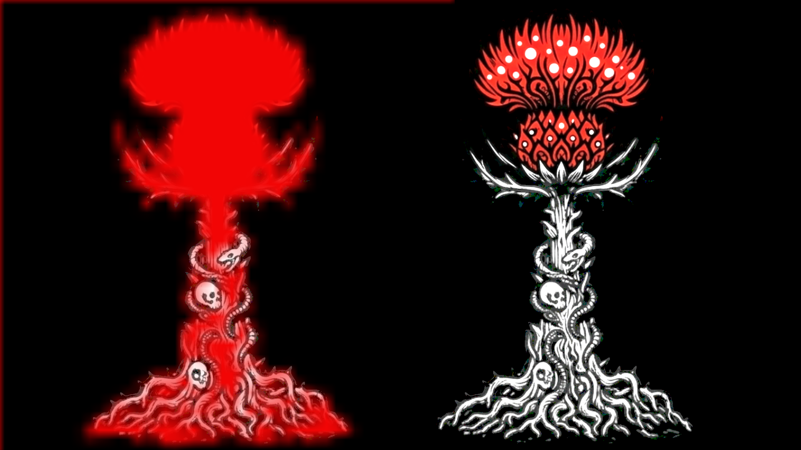
</div>

- **Нолики (O)**  корона 
<div style="text-align: center;">
  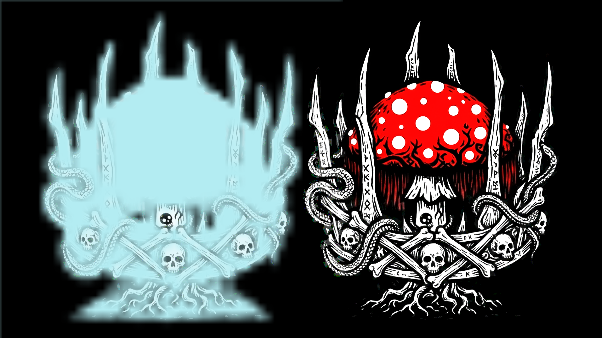
</div>

- **Игрок**  силуэт игрока 
<div style="text-align: center;">
  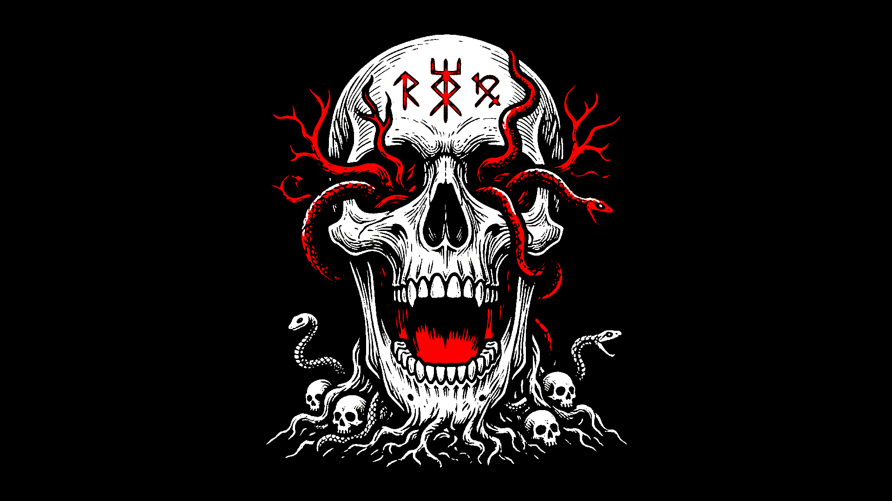
</div>

- **Гриб**  элемент декора 
<div style="text-align: center;">
  
</div>

- **Иконка UUID**  uuid игры
<div style="text-align: center;">
  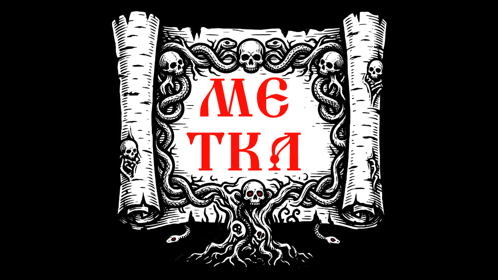
</div>

### Курсор мыши
- **Гриб** — кастомный курсор в виде гриба
<div style="text-align: center;">

</div>

### Где посмотреть
Все иконки доступны в директории `resources/static/image/` проекта. Для просмотра всех элементов дизайна:


## Структура проекта

```
Tic-Tac-Toe/
├── src/
│   ├── main/
│   │   ├── java/com/example/
│   │   │   ├── auth/                    # Слой авторизации
│   │   │   │   ├── config/              # Конфигурация безопасности
│   │   │   │   ├── controller/          # REST контроллеры (Auth, Login, User)
│   │   │   │   ├── filter/              # AuthFilter для Basic Auth
│   │   │   │   ├── model/               # SignUpRequest, User
│   │   │   │   ├── repository/          # UserRepository
│   │   │   │   └── service/             # AuthService, UserService
│   │   │   │
│   │   │   ├── domain/                  # Бизнес-логика
│   │   │   │   ├── model/               # Game, GameBoard, GameStatus, Player, Move
│   │   │   │   └── service/             # GameService, GameServiceImpl
│   │   │   │
│   │   │   ├── datasource/              # Слой доступа к данным
│   │   │   │   ├── entity/              # GameEntity, User
│   │   │   │   ├── mapper/              # DomainDatasourceMapper
│   │   │   │   └── repository/          # GameRepository
│   │   │   │
│   │   │   ├── Web/                     # Web слой
│   │   │   │   ├── controller/          # GameController, RestExceptionHandler
│   │   │   │   ├── mapper/              # DomainWebMapper
│   │   │   │   └── model/               # WebGame, WebMoveRequest, WebErrorResponse
│   │   │   │
│   │   │   ├── di/                      # Dependency Injection конфигурация
│   │   │   │   └── AppConfig.java       # Конфигурация бинов (PasswordEncoder)
│   │   │   │
│   │   │   ── DemoApplication.java     # Точка входа
│   │   │
│   │   └── resources/
│   │       ├── static/
│   │       │   ├── index.html           # Главная страница
│   │       │   ├── login.html           # Страница входа
│   │       │   ├── script.js            # Клиентская логика
│   │       │   ├── css/                 # Стили
│   │       │   │   ├── style.css        # Основные стили
│   │       │   │   └── login.css        # Стили формы входа
│   │       │   ├── fonts/               # Шрифты
│   │       │   │   └── Drevnerusskij Regular.ttf # Декоративный шрифт
│   │       │   └── image/               # Иконки и графика
│   │       │       ├── Pu.png, Pu2.png  # Иконки X 
│   │       │       ├── crown.png, crown2.png  # Иконки O
│   │       │       ├── oo.png           # Иконка игрока
│   │       │       ├── toadstool.png    # Гриб (элемент декора)
│   │       │       └── white.png        # Индикатор ожидания
│   │       |
│   │       └── application.properties   # Конфигурация Spring Boot
│   │
│   └── build.gradle.kts                 # Gradle конфигурация
```


## Установка и запуск

### Требования
- Java 17+
- PostgreSQL 14+
- Gradle (встроен через Gradle Wrapper)

### Шаги для запуска

1. **Клонировать репозиторий**

2. **Создать базу данных PostgreSQL**

```
CREATE DATABASE Tictactoe_db;
```
3. **Настроить подключение к БД**
Отредактировать src/main/resources/application.properties:

```
spring.datasource.url=jdbc:postgresql://localhost:5432/Tictactoe_db
spring.datasource.username=postgres
spring.datasource.password=your_password
```
4. **Собрать и запустить приложение**

```
./gradlew bootRun
```
5. **Открыть в браузере**

```
http://localhost:8086
```


### Выполнение требований ТЗ 
1. Добавление базы данных
 - Подключение к PostgreSQL в application.properties

 - Добавлены аннотации JPA (@Entity, @Table, @Id, @GeneratedValue)

 -  Репозитории наследуются от CrudRepository<br>
    <br>

 2. Добавление авторизации

 - Пользователи с UUID, логином, паролем

 - Поддержка пользователей на всех слоях

 - Модель SignUpRequest (логин + пароль)

 - AuthService с методами register() и authorize()

 - AuthController с endpoints /register и /login

 - AuthFilter extends GenericFilterBean — валидация Basic Auth, возврат 401 при ошибке

 - SecurityConfig — SecurityFilterChain, permitAll() для /auth/** и статики<br>
<br>

3. Добавление логики игры между двумя игроками

 - Состояния игры: WAITING, IN_PROGRESS, X_WON, O_WON, DRAW

 - Информация о знаках (X/O) привязана к UUID игроков

 - Endpoint POST /game/create?mode=PVE/PVP

 - Endpoint GET /game/available — список доступных игр

 - Endpoint POST /game/{id}/join — присоединение к игре

 - Endpoint POST /game/{id}/move — с учётом PvP/PvE (автоход компьютера)

 - Endpoint GET /game/{id} — получение текущей игры

 - Endpoint GET /user/{userId} — информация о пользователе


### Алгоритм Minimax (AI)
В режиме PvE компьютер использует классический алгоритм Minimax:

Рекурсивный перебор всех возможных ходов

Оценка позиции: +10 — победа компьютера, -10 — победа игрока, 0 — ничья

Глубина учитывается для приоритета быстрой победы


*Проект выполнен в рамках учебного курса Java Bootcamp и не предназначен для коммерческого использования.*